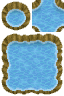
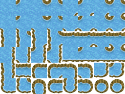
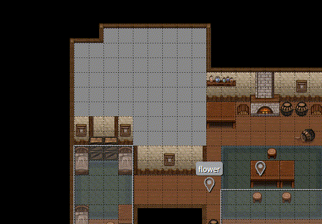

# AutoTileWebpackPlugin

[](https://www.npmjs.com/package/auto-tile-webpack-plugin)
[](https://github.com/laineus/auto-tile-webpack-plugin/blob/master/LICENSE)

A Webpack plugin to generate expanded autotiles and its setting for Tiled from minimal autotiles automatically.

It will be re-generated automatically when added or modified images while webpack is watching.

|Original|Expanded|
|---|---|
|||

# Usage

Install:

```
$ npm install auto-tile-webpack-plugin
```

Define into `webpack.config.js`:

```js
const AutoTileWebpackPlugin = require('auto-tile-webpack-plugin')
// ...
{
  entry: {
    ...
  },
  output: {
    ...
  },
  plugins: [
    new AutoTileWebpackPlugin({
      size: 32,
      input: './public/img/original_autotiles',
      output: './public/img/tilesets'
    })
  ]
}
```

```
- public/img/
  - original_autotiles/
    - town.png // Minimal autile image (Follow `examples/input.png`)
  - tilesets/
    - town.png // Generated image
    - town.tmx // Generated setting for Tiled
```

Options:

|Key|What is|
|---|---|
|size|Tile size.|
|input|Input directory. Original images should be here.|
|output|Output directory. Extruded images will be here.|



## Use it on Tiled

Make a rules.txt that listed path to settings and place it under your project directory for Tiled.

```
path/to/town.tmx
path/to/dungeon.tmx
..
```

- The around of the autotiles need to be filled with something another tile.
- Layer name need to be same as file name. (`town.png` -> `town`)

# Requirements

- Webpack4 or higher

I'm not sure if this will be working on Webpack3 or less.
Please make an issue or PR if need it.
